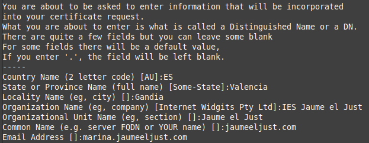
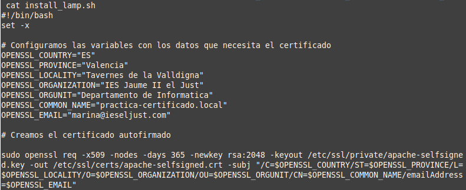

# Creación y configuración de un certificado SSL/TLS autofirmado en Apche


## Creación del certificado autofirmado
Para crear el certificado autofirmado utilidadopenssl usaremos el siguiente comando: 
```
sudo openssl req -x509 -nodes -days 365 -newkey rsa:2048 -keyout /etc/ssl/private/apache-selfsigned.key -out /etc/ssl/certs/apache-selfsigned.crt
```
Introducimos unos datos que se añadirán al certificado.
En mi caso he añadido los siguientes:



## Automatizar la creación de un certificado autofirmado
Crearemos un script bash donde especificaremos los argumentos que le pasaremos al comando
anterior a través del parámetro **-subj**.

```
#!/bin/bash
set -x

# Variables con los datos del certificado
OPENSSL_COUNTRY="ES"
OPENSSL_PROVINCE="Valencia"
OPENSSL_LOCALITY="Gandia"
OPENSSL_ORGANIZATION="IES Jaume II el Just"
OPENSSL_ORGUNIT="Departamento de Informatica"
OPENSSL_COMMON_NAME="practica-certificado.local"
OPENSSL_EMAIL="marina@ieseljust.com"

# Creación del certificado
sudo openssl req -x509 -nodes -days 365 -newkey rsa:2048 -keyout /etc/ssl/private/apache-selfsigned.key -out /etc/ssl/certs/apache-selfsigned.crt -subj "/C=$OPENSSL_COUNTRY/ST=$OPENSSL_PROVINCE/L=$OPENSSL_LOCALITY/O=$OPENSSL_ORGANIZATION/OU=$OPENSSL_ORGUNIT/CN=$OPENSSL_COMMON_NAME/emailAddress=$OPENSSL_EMAIL"

```



## Mi Script

Puedes descargar el script haciendo clic en el siguiente botón:

[Paco cabron](../../install_lamp.sh){ .md-button .md-button--primary }


