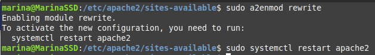

# Creación y configuración de un certificado SSL/TLS autofirmado en Apche


## Creación del certificado autofirmado
Para crear el certificado autofirmado utilidadopenssl usaremos el siguiente comando: 
```
sudo openssl req -x509 -nodes -days 365 -newkey rsa:2048 -keyout /etc/ssl/private/apache-selfsigned.key -out /etc/ssl/certs/apache-selfsigned.crt
```
Introducimos unos datos que se añadirán al certificado.
En mi caso he añadido los siguientes:


## Automatizar la creación de un certificado autofirmado
Crearemos un script bash donde especificaremos los argumentos que le pasaremos al comando
anterior a través del parámetro **-subj**.

```
#!/bin/bash
set -x

# Variables con los datos del certificado
OPENSSL_COUNTRY="ES"
OPENSSL_PROVINCE="Valencia"
OPENSSL_LOCALITY="Gandia"
OPENSSL_ORGANIZATION="IES Jaume II el Just"
OPENSSL_ORGUNIT="Departamento de Informatica"
OPENSSL_COMMON_NAME="practica-certificado.local"
OPENSSL_EMAIL="marina@ieseljust.com"

# Creación del certificado
sudo openssl req -x509 -nodes -days 365 -newkey rsa:2048 -keyout /etc/ssl/private/apache-selfsigned.key -out /etc/ssl/certs/apache-selfsigned.crt -subj "/C=$OPENSSL_COUNTRY/ST=$OPENSSL_PROVINCE/L=$OPENSSL_LOCALITY/O=$OPENSSL_ORGANIZATION/OU=$OPENSSL_ORGUNIT/CN=$OPENSSL_COMMON_NAME/emailAddress=$OPENSSL_EMAIL"

```


## Script 

Puedes descargar el script haciendo clic en el siguiente botón:

[Descargar Script](install_lamp.sh){ .md-button .md-button--primary }


## Configuración del host virtual con SSL/TSL en el servidor Apache
Copiamos el archivo "default-ssl.conf", que es la configuración del VirtualHost, donde habilitaremos el tráfico http
y lo editamos.

* sudo cd /et/apache2/sites-available
* sudo cp default-ssl.conf certificado-ssl.conf 
* sudo nano certificado-ssl.conf


```
<VirtualHost *:443>
    #ServerName practica-certificado.local
    DocumentRoot/var/www/html
    DirectoryIndex index.php index.html
    SSLEngine on
    SSLCertificateFile /etc/ssl/certs/apache-selfsigned.crt
    SSLCertificateKeyFile /etc/ssl/private/apache-selfsigned.key
</VirtualHost>
```

1. Habilitaremos el VirtualHost que acabamos de configurar
    
      * sudo a2ensite certificado-ssl.conf


2. Habilitaremos el módulo SSL en Apache y reiniciaremos el servicio

       * sudo a2enmod ssl
       * sudo systemctl restart apache2


       * sudo systemctl status apache2


3. Copiamos y editamos el VirtualHost de HTTP para que redirija todo el tráfico a HTTPS

      * sudo cd /et/apache2/sites-available
      * sudo cp 000-default-ssl.conf 000-certificado-ssl.conf 
      * sudo nano 000-certificado-ssl.conf

```
    <VirtualHost *:80>
        #ServerName practica-certificado.local
        DocumentRoot/var/www/html
        #Redirige alpuerto 443 (HTTPS)
        RewriteEngineOn
        RewriteCond%{HTTPS} off
        RewriteRule^ https://%{HTTP_HOST}%{REQUEST_URI} [L,R=301]
    </VirtualHost>
```

4. Habilitaremos el módulo rewrite y reiniciamos en servicio
       * sudo a2enmod rewrite
       * sudo systemctl restart apache2


       * sudo systemctl status apache2


5. Nos aseguramos de que el puerto 443 esté abierto en las reglas del firewall para permitir  el trafico hhtps.


Una vez hecho todo esto, abriremos un navegador y accederemos al nombre de nuestro dominio.
En mi caso será:
```
https://practica-certificado.local.
```


