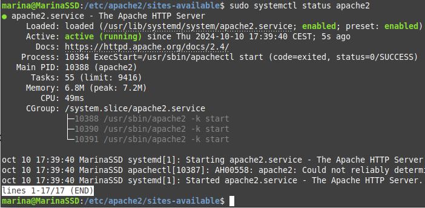
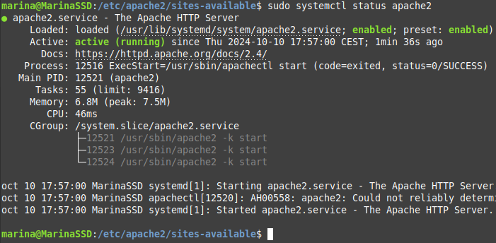

# Creación y configuración de un certificado SSL/TLS autofirmado en Apche


## Creación del certificado autofirmado
Para crear el certificado autofirmado utilidadopenssl usaremos el siguiente comando: 
```
sudo openssl req -x509 -nodes -days 365 -newkey rsa:2048 -keyout /etc/ssl/private/apache-selfsigned.key -out /etc/ssl/certs/apache-selfsigned.crt
```
Introducimos unos datos que se añadirán al certificado.
En mi caso he añadido los siguientes:


## Automatizar la creación de un certificado autofirmado
Crearemos un script bash donde especificaremos los argumentos que le pasaremos al comando
anterior a través del parámetro **-subj**.

```
#!/bin/bash
set -x

# Variables con los datos del certificado
OPENSSL_COUNTRY="ES"
OPENSSL_PROVINCE="Valencia"
OPENSSL_LOCALITY="Gandia"
OPENSSL_ORGANIZATION="IES Jaume II el Just"
OPENSSL_ORGUNIT="Departamento de Informatica"
OPENSSL_COMMON_NAME="practica-certificado.local"
OPENSSL_EMAIL="marina@ieseljust.com"

# Creación del certificado
sudo openssl req -x509 -nodes -days 365 -newkey rsa:2048 -keyout /etc/ssl/private/apache-selfsigned.key -out /etc/ssl/certs/apache-selfsigned.crt -subj "/C=$OPENSSL_COUNTRY/ST=$OPENSSL_PROVINCE/L=$OPENSSL_LOCALITY/O=$OPENSSL_ORGANIZATION/OU=$OPENSSL_ORGUNIT/CN=$OPENSSL_COMMON_NAME/emailAddress=$OPENSSL_EMAIL"

```


## Script 

Puedes descargar el script haciendo clic en el siguiente botón:

[Descargar Script](install_lamp.sh){ .md-button .md-button--primary }


## Configuración del host virtual con SSL/TSL en el servidor Apache
Copiamos el archivo "default-ssl.conf", que es la configuración del VirtualHost, donde habilitaremos el tráfico http
y lo editamos.

* sudo cd /et/apache2/sites-available
* sudo cp default-ssl.conf certificado-ssl.conf 
* sudo nano certificado-ssl.conf


```
<VirtualHost *:443>
    #ServerName practica-certificado.local
    DocumentRoot/var/www/html
    DirectoryIndex index.php index.html
    SSLEngine on
    SSLCertificateFile /etc/ssl/certs/apache-selfsigned.crt
    SSLCertificateKeyFile /etc/ssl/private/apache-selfsigned.key
</VirtualHost>
```

1. Habilitaremos el VirtualHost que acabamos de configurar
    
      * sudo a2ensite certificado-ssl.conf


2. Habilitaremos el módulo SSL en Apache y reiniciaremos el servicio

       * sudo a2enmod ssl
       * sudo systemctl restart apache2


       * sudo systemctl status apache2



3. Copiamos y editamos el VirtualHost de HTTP para que redirija todo el tráfico a HTTPS

      * sudo cd /et/apache2/sites-available
      * sudo cp 000-default-ssl.conf 000-certificado-ssl.conf 
      * sudo nano 000-certificado-ssl.conf

```
    <VirtualHost *:80>
        #ServerName practica-certificado.local
        DocumentRoot/var/www/html
        #Redirige alpuerto 443 (HTTPS)
        RewriteEngineOn
        RewriteCond%{HTTPS} off
        RewriteRule^ https://%{HTTP_HOST}%{REQUEST_URI} [L,R=301]
    </VirtualHost>
```

4. Habilitaremos el módulo rewrite y reiniciamos en servicio
       * sudo a2enmod rewrite
       * sudo systemctl restart apache2


      * sudo systemctl status apache2



5. Nos aseguramos de que el puerto 443 esté abierto en las reglas del firewall para permitir  el trafico hhtps.


6. Modificamos el fichero /etc/hosts

     * sudo nano /etc/hosts


Una vez hecho todo esto, abriremos un navegador y accederemos al nombre de nuestro dominio.
En mi caso será:
```
https://practica-certificado.local
```


