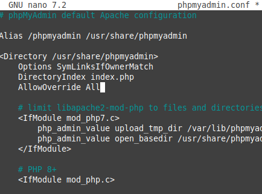
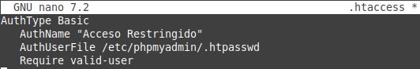

# Instalar, configurar y securizar phpMyAdmin

## Prerrequisitos
Antes de instalar PHP, deberías instalar:

* Apache (hecho en la práctica anterior)
* MySQL
    * sudo apt update
    * sudo apt install mysql-server


## Instalación de phpMyAdmin
1. Instala phpMyAdmin junto con las extensiones PHP necesarias.
    * sudo apt install php-mbstring php-zip php-gd php-json php-curl
```
php-mbstring, php-zip, php-gd, php-json, php-curl
```


  * sudo apt install php libapache2-mod-php


Para comprobar que hemos instalado bien php crearemos un archivo con la siguiente información y lo buscaremos a través del navegador.
* sudo nano /var/www/info.php
```
<?php
phpinfo();
?>
```
  * http://*IP*/*nombre_archivo*
    * En mi caso será http://10.10.10.196/info.php
  


2. Configurar phpMyAdmin para que funcione con Apache.
  * sudo apt install phpmyadmin

Para configurarlo correctamente elejiremnos las siguientes opciones:

  * apache2 --> para el servidor
  * sí --> cuando nos pregunte si queremos usar dbconfig-common para configurar la base de datos
  * Asignaremos una contraseña, en mi caso le he puesto:
    * phpmyadmin
> En mi caso la instalación ya estaba hecha, no he podido poner capturas.
  * Vamos a habilitar el archivo de configuración de phpmyadmin
    * cd /etc/phpmyadmin/apache.conf
    * sudo cp apache.conf /etc/conf-available/phpmyadmin.conf
    * sudo a2enconf phpmyadmin.conf


. Habilita la extensión mbstring y reinicia Apache
  * sudo phpenmod mbstring
  * sudo systemctl restart apache


------------------------------------------------------------------------

## Configuración del Acceso por Contraseña para la Cuenta Root de MySQL
1. Cambia el método de autenticación del usuario root de MySQL (de auth_socket a caching_sha2_password o mysql_native_password)
  * sudo mysql
  * select user,host,authentication_string,plugin from mysql.user;


  * alter user 'root'@'localhost' identified with 'mysql_native_password' by 'root';


1. Verificar los métodos de autenticación empleados por cada uno de tus usuarios.
  * Entraremos introduciendo la contraseña que le hemos asignado en el paso anterior con el comando:
    * sudo mysql -u root -p


------------------------------------------------------------------------

## Configuración del Acceso por Contraseña para un Usuario Dedicado de MySQL
1. Crear un nuevo usuario de MySQL con una contraseña segura.
* create user 'marina'@'localhost' identified with 'mysql_native_password' by 'phpmyadmin'; 


2. Otorgar al nuevo usuario los privilegios apropiados para gestionar las bases de datos a través de phpMyAdmin
* grant all privileges on *.* to 'marina'@'localhost' with grant option;


* Comprobamos que podemos acceder a la interfaz web
  * https://*your_domain_or_IP*/phpmyadmin
    * En mi caso será https://*your_domain_or_IP*/phpmyadmin

------------------------------------------------------------------------

## Asegurando tu Instancia de phpMyAdmin
1. Habilitar el uso de sobrescrituras de archivos **.htaccess** en la configuración de Apache para phpMyAdmin.
  * Editamos el archivo **phpmyadmin.con** y le añadimos la línea **AllowOverride All**
    * sudo nano /etc/apache2/conf-available/phpmyadmin.conf
    * Tendria que quedar de la siguiente forma:
```
<Directory /usr/share/phpmyadmin>
        Options SymLinksIfOwnerMatch
        DirectoryIndex index.php
        AllowOverride All
        ...  # Otras directivas
</Directory>
```



2. Crear un archivo **.htaccess** en el directorio de phpMyAdmin para implementar autenticación básica.
  * Creamos el archivo y lo editamos
    * cd /usr/share/phpmyadmin
    * sudo nano .htaccess
    * Tendria que quedar de la siguiente forma:
```
AuthType Basic
   AuthName "Acceso Restringido"
   AuthUserFile /etc/phpmyadmin/.htpasswd
   Require valid-user
```



3. Crear un archivo **.htpasswd** para almacenar las credenciales de usuario y contraseña.
  * sudo htpasswd -c /etc/phpmyadmin/.htpasswd phpmyadmin
    * phpmyadmin_htaccess


4. Reiniciar Apache para aplicar los cambios.
  * sudo systemctl restart apache2
  * sudo systemctl status apache2


## Comprovar que funciona
* http://*IP*/*nombre_archivo*
    * En mi caso será http://192.168.0.144/phpmyadmin

