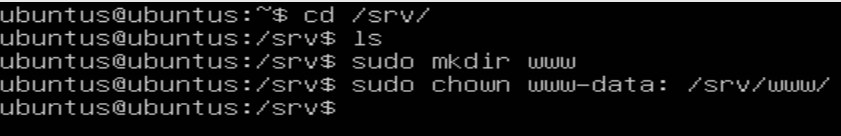
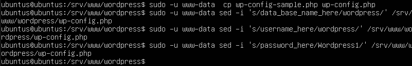
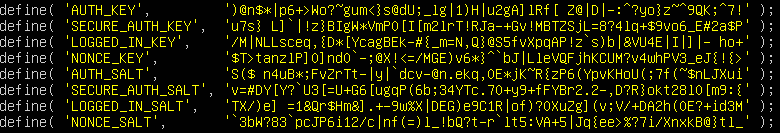

# Instalar y configurar WordPress

## Instalar máquinas
Instalamos 2 máquinas virtuales Ubuntu Server 22.04

en las egunda maquina hay que instalar el php, mysql-client, apache

## Instalar dependencias

```
sudo apt update
sudo apt install apache2 \
                 ghostscript \
                 libapache2-mod-php \
                 mysql-server \
                 php \
                 php-bcmath \
                 php-curl \
                 php-imagick \
                 php-intl \
                 php-json \
                 php-mbstring \
                 php-mysql \
                 php-xml \
                 php-zip
```


--------------------------------------------------------------------------

## Instalar WordPress
Vamos a crear el directorio de instalación, ha descargar el archivo de WordPress.org y ha instalar wordpress.
```
cd /srv
sudo mkdir www
sudo chown www-data: /srv/www
curl https://wordpress.org/latest.tar.gz | sudo -u www-data tar zx -C /srv/www
```



--------------------------------------------------------------------------

## Configurar Apache para WordPress
Crearemos el siguiente sitio apache para wordpress:
```
cd /etc/apache2/sites-available
sudo nano wordpress.conf
```

```
<VirtualHost *:80>
    DocumentRoot /srv/www/wordpress
    <Directory /srv/www/wordpress>
        Options FollowSymLinks
        AllowOverride Limit Options FileInfo
        DirectoryIndex index.php
        Require all granted
    </Directory>
    <Directory /srv/www/wordpress/wp-content>
        Options FollowSymLinks
        Require all granted
    </Directory>
</VirtualHost>
```


* Habilitamos el sitio:
```
sudo a2ensite wordpress
```


* Habilita la reescritura de URL con:
```
sudo a2enmod rewrite
```


* Deshabilitamos el sitio predeterminado:
```
sudo a2dissite 000-default.conf
```


* Recargamos y reiniciamos el apache2 para aplicar los cambios:
```
sudo service apache2 reload
sudo systemctl restart apache2
sudo systemctl status apache2
```


--------------------------------------------------------------------------

## Configurar la base de datos MySQL

Para configurar WordPress, necesitamos crear una base de datos MySQL.
La base de datos MySQL se ejecutará en un servidor distinto que Apache y PHP.
Instalamos una máquina ubuntu server, le instalamos mysql y creamos o modificamos el usuario root.


Antes de seguir comprobamos que tenemos el *mysql-server* instalado
```
sudo apt update
sudo apt install mysql-server
```


### Configurar MySQL para conexiones remotas
Para permitir conexiones remotas a MySQL, modificaremos la configuración de mysqld.
```
cd /etc/mysql/mysql.conf.d/mysqld.cnf
sudo nano mysqld.conf
```

Buscamos la linea de bind-address. 
Por defecto MySQL solo permite conexionews desde localhost (127.0.0.1).
Modificamos el valor por la dirección IP de la máquina donde se está ejecutando
el servicio de MySQL. Añadimos lo siguiente:
```
[mysqld]
bind-address = 0.0.0.0
```
*La ip 0.0.0.0 permite conexiones desde cualquier interfaz de red que tenga la máquina.*


*Antes de seguir nos aseguramos de que tenemos el mysql-client instalado o no podremos hacer los siguientes pasos*


Iniciamos sesión en MySQL:
```
sudo mysql -u root
```


Crearemos la base de datos para wordpress:
```
CREATE DATABASE wordpress;
CREATE USER wordpress@localhost IDENTIFIED BY '<tu-contraseña>';
GRANT SELECT,INSERT,UPDATE,DELETE,CREATE,DROP,ALTER
    ON wordpress.*
    TO wordpress@localhost;
FLUSH PRIVILEGES;
quit
```


Habilitamos MySQL:
```
sudo service mysql start
```


--------------------------------------------------------------------------

## Configurar WordPress para conectarse a la base de datos
Configuremos WordPress para usar esta base de datos.
Copia el archivo de configuración de muestra "*wp-config-sample.php*"a "*wp-config.php*":
```
cd /srv/www/wordpress
sudo -u www-data cp wp-config-sample.php wp-config.php
```


Establecemos las credenciales de la base de datos en el archivo de configuración:
```
sudo -u www-data sed -i 's/data_base_name_here/wordpress/' /srv/www/wordpress/wp-config.php
sudo -u www-data sed -i 's/username_here/wordpress/' /srv/www/wordpress/wp-config.php
sudo -u www-data sed -i 's/password_here/<tu-contraseña>/' /srv/www/wordpress/wp-config.php
```
*Remplazaremos "tu-contraseña" por ls contraseña de la base de datos. En mi caso es: Wordpress1*


Iniciamos sesión desde la terminal al archivo de configuración:
```
sudo -u www-data nano /srv/www/wordpress/wp-config.php
```

Buscaremos las siguientes lineas y las editaremos poniendo lo siguiente:
```
define( 'AUTH_KEY',         ')@n$*|p6+>Wo?~gum<}s@dU;_lg|1)H|u2gA]lRf[ Z@|D|-:^?yo}z~^9QK;^7!' );
define( 'SECURE_AUTH_KEY',  'u7s} L]`|!z}BIgW*VmP0[I[m2lrT!RJa-+Gv!MBTZSjL=8?41q+$9vo6_E#2a$P' );
define( 'LOGGED_IN_KEY',    '/M|NLLsceq,{D*[YcagBEk-#{_m=N,Q}@S5fvXpqAP!z`s)b|&VU4E|I|]|- ho+' );
define( 'NONCE_KEY',        '$T>tanzlP]O]nd0`-;@X!<=/MGE)v6*}(^bJ|LleVQFjhKCUM?v4whPV3_eJ{!{>' );
define( 'AUTH_SALT',        'S($ n4uB*;FvZrTt-|y|`dcv-@n.ekq,0E*jK~R{zP6(YpvKHoU(;7f(~$nLJXui' );
define( 'SECURE_AUTH_SALT', 'v=#DY[Y?`U3[=U+G6[ugqP(6b;34YTc.70+y9+fFYBr2.2-,D?R}okt28l0[m9:{' );
define( 'LOGGED_IN_SALT',   'TX/)e] =1&Qr$Hm&].+-9w%X|DEG)e9C1R|of)?0XuZg](v;V/+DA2h(0E?+id3M' );
define( 'NONCE_SALT',       '`3bW?83^pcJP6i12/c|nf(=)l_!bQ?t-r`lt5:VA+5|Jq{ee>%?7i/XnxkB@}tl_' );
```


--------------------------------------------------------------------------

## Configurar WordPress
Abrimos nuestro navegador y ponemos lo siguiente para conectarnos al servidor donde tenemos la base de datos:
```
http://10.10.10.40/
```


He tenido un problema y me sale un error


Nos pedirá:

* Título de tu nuevo sitio
* Nombre de usuario
* Contraseña
* Dirección de correo electrónico

Ten en cuenta que el nombre de usuario y la contraseña que elijamos aquí
son para WordPress, y no proporcionan acceso a ninguna otra parte de tu servidor.

Elegimos un nombre de usuario y contraseña diferentes de las credenciales de MySQL y
de las credenciales para iniciar sesión en el equipo o escritorio o shell del servidor.


* Ahora ya podemos iniciar sesión:
```
http://10.10.10.40/wp-login.php
```


