# Instalar y configurar WordPress

## Requisitos
Antes de empezar la practica necesitamos saber lo siguiente:

### Instalación de máquinas
Instalamos 3 máquinas virtuales Ubuntu Server 22.04
Usaremos el usuario root o un usuario con privilegios sudo

### Dominios a usar
Usaremos los siguientes dominio con las siguiente estructura:

* balancer.iaw2425.com
* web1i.aw2425.com
* web2.iaw2425.com

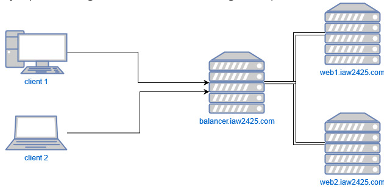

--------------------------------------------------------------------------

## Instalamos el servidor web Apache
Verificamos el estado del servidor Apache:
```
systemctl status apache2

```
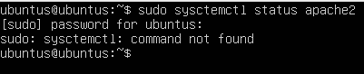

En caso de que no esté instalado lo instalamos:
```
sudo apt update
sudo apt install apache2
```
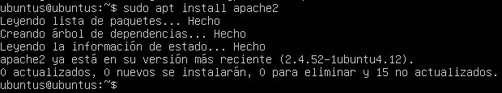

*Todo esto teniendo en cuenta que hay que hacerlo en todos los servidores (los 3 que tenemos que configurar)*

--------------------------------------------------------------------------

## Configuración del Primer servidor Bakend Apache --> WEB1
Creamos una páquina HTML de muestra en el servidor apache "web1" donde pondremos el siguiente código:
```
cd /var/www/html/
sudo nano web1.html
```


```
<!DOCTYPE html PUBLIC "-//W3C//DTD XHTML 1.0 Transitional//EN" "http://www.w3.org/TR/xhtml1/DTD/xhtml1-transitional.dtd">
<title>Servidor Web Apache 1</title>
<h2>¡Esta es la página del Servidor Web Apache 1!</h2>
</html>
```
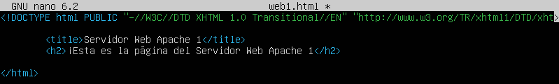

A continuación, dentro del servidor apache "web1", copiamos el archivo de configuración de host virtual y cambiamos las siguientes configuraciones:

```
cd /etc/apache2/sites-enabled/
sudo cp 000-default.conf web1.conf
sudo nano web1.conf
```
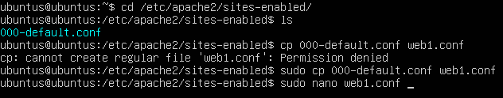

```
<VirtualHost *:80>
    ServerName web1.iaw2425.com
    ServerAdmin webmaster@localhost
    DocumentRoot /var/www/html
    DirectoryIndex web1.html
    ErrorLog ${APACHE_LOG_DIR}/error.log
    CustomLog ${APACHE_LOG_DIR}/access.log combined
</VirtualHost>
```
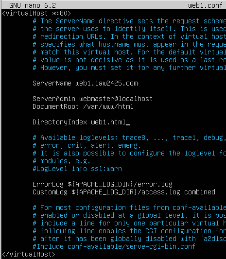

Reiniciamos el servicio de apache:
```
sudo systemctl restart apache2
sudo systemctl status apache2
```
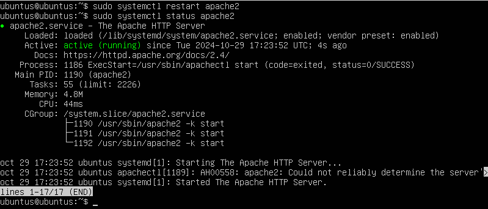

--------------------------------------------------------------------------

## Configuración del Segundo servidor Bakend Apache --> WEB2
Creamos una páquina HTML de muestra en el servidor apache "web2" donde pondremos el siguiente código:
```
cd /var/www/html/
sudo nano web2.html
```
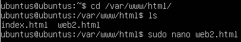

```
<!DOCTYPE html PUBLIC "-//W3C//DTD XHTML 1.0 Transitional//EN" "http://www.w3.org/TR/xhtml1/DTD/xhtml1-transitional.dtd">
<title>Servidor Web Apache 2</title>
<h2>¡Esta es la página del Servidor Web Apache 2!</h2>
</html>
```
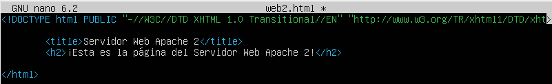

A continuación, dentro del servidor apache "web2", creamos el archivo de configuración de host virtual con las siguientes configuraciones:

```
cd /etc/apache2/sites-enabled/
sudo cp 000-default.conf web1.conf
sudo nano web2.conf
```
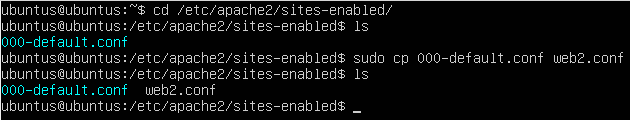

```
<VirtualHost *:80>
    ServerName web2.iaw2425.com
    ServerAdmin webmaster@localhost
    DocumentRoot /var/www/html
    DirectoryIndex web2.html
    ErrorLog ${APACHE_LOG_DIR}/error.log
    CustomLog ${APACHE_LOG_DIR}/access.log combined
</VirtualHost>
```


Reiniciamos el servicio de apache:
```
systemctl restart apache2
systemctl status apache2
```


--------------------------------------------------------------------------

## Creación de un Balanceador de Carga Apache
Configuramos el tercer servidor como un servidor de balanceo de carga para redirigir el tráfico a los dos servidoires web backend que hemos creado en los pasos anteriores.

Habilitamos los modulos proxy en el servidor de balanceo de carga:
```
sudo a2enmod proxy
sudo a2enmod proxy_http
sudo a2enmod proxy_balancer
sudo a2enmod lbmethod_byrequests
```
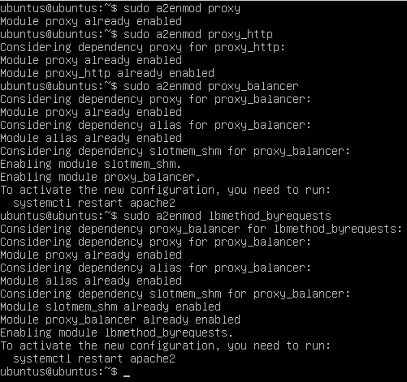

Reiniciamos el servicio de apache:
```
systemctl restart apache2
systemctl status apache2
```


Verificamos todos los módulos proxy:
```
apachectl -M | grep proxy
```
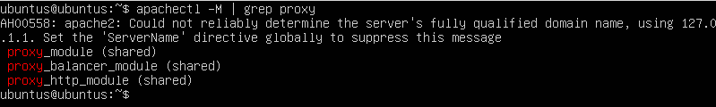

Creamos un archivo de configuración de Apache para el balanceo de carga y le añadimos lo siguiente:
```
cd /etc/apache2/sites-enabled/
sudo nano loadbalancer.conf
```
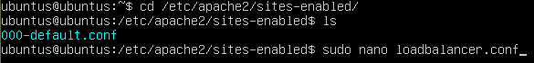

```
<VirtualHost *:80>
    ServerName balancer.iaw2425.com
    <Proxy balancer://webserver>
        # servidor 1
        BalancerMember http://web1.iaw2425.com
        #BalancerMember http://IP_HTTP_SERVER_1:80

        #servidor 2
        BalancerMember http://web2.iaw2425.com
        #BalancerMember http://IP_HTTP_SERVER_1:80

        ProxySet stickysession=ROUTEID
    </Proxy>
    ProxyPreserveHost On
    ProxyPass / balancer://webserver/
    ProxyPassReverse / balancer://webserver/
</VirtualHost>
```
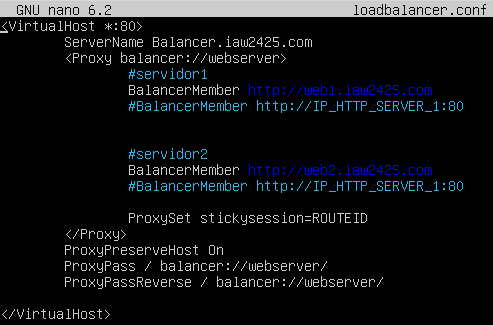

--------------------------------------------------------------------------

## Configuración de la Política de Balanceo de Carga
Para configurar la política de balanceo de carga necesitamos tener el módulo **proxy_balancer** activado:

```
sudo a2enmod proxy_balancer
```
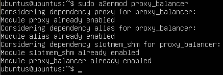

El tipo de balanceo de carga que vamos a usar en esta práctica será un balanceo de tipo **Round Robin**.

**Round Robin**

* Este método consiste en distribuir las peticiones entre los servidores de forma que cada vez que llegue una nueva petición se envía al siguiente servidor de la lista de servidores configurados en el servidor Apache.Este método es simple y fácil de configurar, pero no es efectivo para la alta disponibilidad y la escalabilidad.

Para activar este método de balanceo tenemos que activar el siguiente módulo:
```
sudo a2enmod lbmethod_byrequests
```
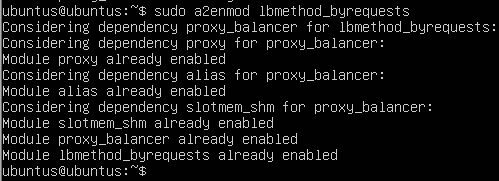

Reiniciamos el servicio de apache:
```
systemctl restart apache2
systemctl status apache2
```


--------------------------------------------------------------------------

## Verificar el Balanceo de Carga con Apache
Abrimos nuestro navegador y accedemos al balanceador de carga:
```
http://balancer.iaw2425.com
```
Espera un tiempo y actualiza la página. Esta vez, deberías ver la página HTML de muestra de tu segundo servidor backend.


